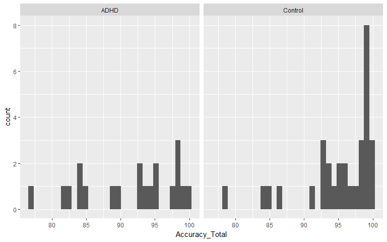
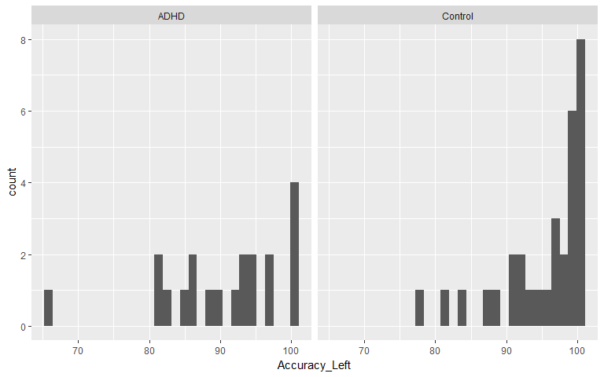
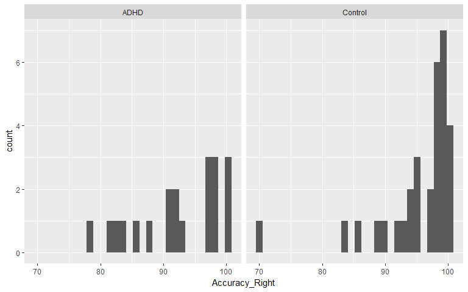
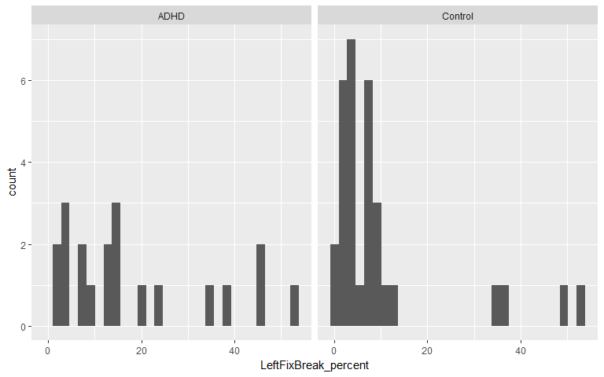
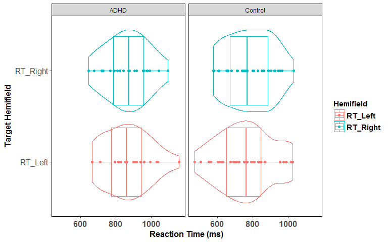
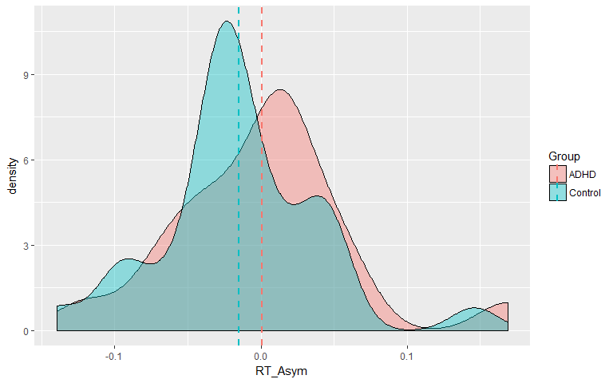
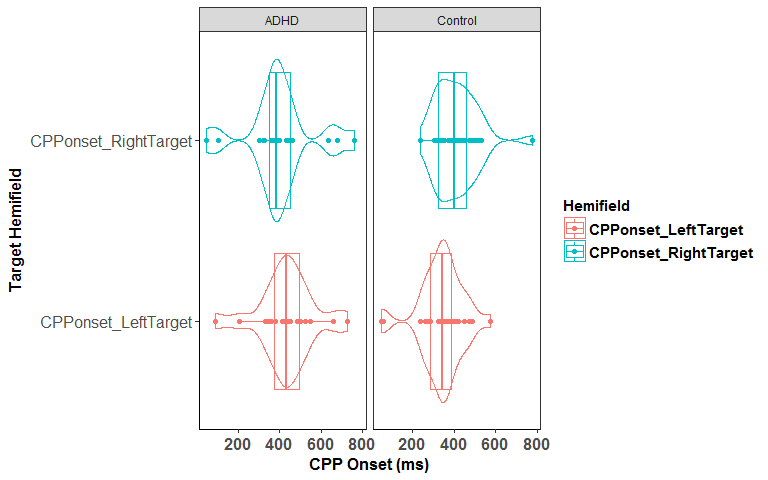
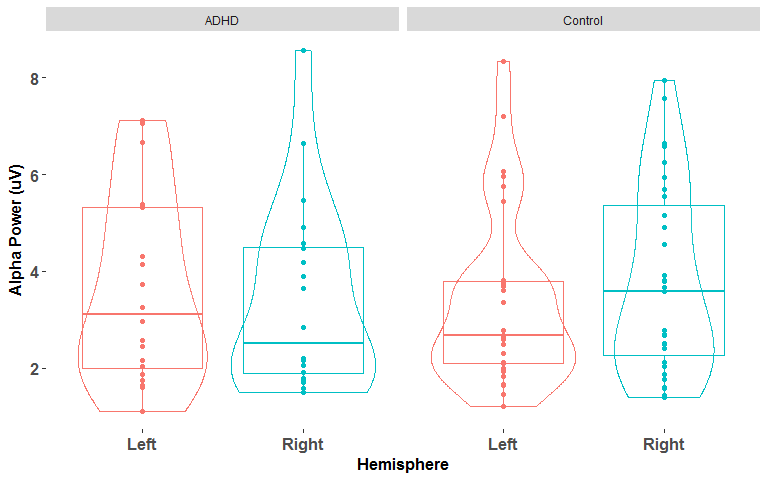
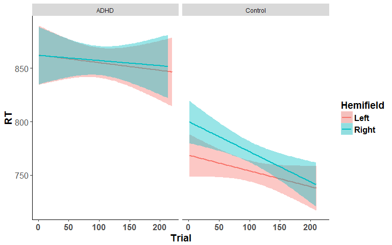

# ADHD_Control_Markdown
Daniel Newman  


#Are there significant Accuracy differences between ADHD and Controls?


```
## [1] 77
```

```
## [1] 65.30612
```

```
## [1] 69.69697
```

```
## `stat_bin()` using `bins = 30`. Pick better value with `binwidth`.
```

<!-- -->

```
## `stat_bin()` using `bins = 30`. Pick better value with `binwidth`.
```

<!-- -->

```
## `stat_bin()` using `bins = 30`. Pick better value with `binwidth`.
```

<!-- -->

```
## [1] "Factorial Permutation test for the effect of Group on Overall Accuracy:"
```

```
##   Effect     p p<.05
## 1  Group 0.038     *
```

```
## [1] "Factorial Permutation test for the effect of Group on Accuracy for left targets:"
```

```
##   Effect     p p<.05
## 1  Group 0.023     *
```

```
## [1] "Factorial Permutation test for the effect of Group on Accuracy for right targets:"
```

```
##   Effect     p p<.05
## 1  Group 0.123
```

```
## [1] "Factorial Permutation test for the effect of Group on Accuracy Asym:"
```

```
##   Effect     p p<.05
## 1  Group 0.324
```

```
## [1] "Factorial Permutation test for the Group*Hemifield effect on Accuracy:"
```

```
##            Effect     p p<.05
## 1           Group 0.037     *
## 2       Hemifield 0.435      
## 3 Group:Hemifield 0.299
```


#Are there significant Fixation breaks differences between ADHD and Controls?


```
## [1] "Factorial Permutation test for the effect of Group on Leftward Fixation Breaks:"
```

```
##   Effect     p p<.05
## 1  Group 0.037     *
```

```
## `stat_bin()` using `bins = 30`. Pick better value with `binwidth`.
```

<!-- -->

```
## [1] "Factorial Permutation test for the effect of Group on Rightward Fixation Breaks:"
```

```
##   Effect     p p<.05
## 1  Group 0.096
```


#Run tests of normality on the participant_level RT, CPPonset, N2c, etc. measures 

Table: Normality tests

key                                  ShapiroWilk_p_value   Anderson_Darling_p_value   CramerVonMises_p_value   Shapiro_Francia_p_value   Kolmogorov_Smirnov_p_value   average_p_value
----------------------------------  --------------------  -------------------------  -----------------------  ------------------------  ---------------------------  ----------------
AlphaDesync_RightHemi_LeftTarget                  0.0000                     0.0000                   0.0000                    0.0001                       0.0000            0.0000
N2i_latency_RightTarget                           0.0000                     0.0000                   0.0000                    0.0000                       0.0001            0.0000
AlphaDesync_RightHemi_RightTarget                 0.0008                     0.0001                   0.0001                    0.0010                       0.0021            0.0008
PreAlpha_RightHemi                                0.0005                     0.0003                   0.0009                    0.0016                       0.0009            0.0008
PreAlpha_LeftHemi                                 0.0004                     0.0001                   0.0002                    0.0011                       0.0030            0.0010
CPPonset_RightTarget                              0.0016                     0.0007                   0.0023                    0.0012                       0.0046            0.0021
AlphaDesync_LeftHemi_RightTarget                  0.0001                     0.0002                   0.0011                    0.0003                       0.0443            0.0092
N2i_latency_LeftTarget                            0.0020                     0.0034                   0.0083                    0.0084                       0.0671            0.0178
N2c_latency_RightTarget                           0.0158                     0.0107                   0.0183                    0.0357                       0.0255            0.0212
N2i_RightTarget_PA                                0.0070                     0.0786                   0.1038                    0.0048                       0.0985            0.0585
CPPonset_LeftTarget                               0.0810                     0.0570                   0.0916                    0.0417                       0.0412            0.0625
CPPslope_LeftTarget                               0.0577                     0.1297                   0.1773                    0.0864                       0.1789            0.1260
N2i_LeftTarget_GA                                 0.3422                     0.1205                   0.0852                    0.1996                       0.0196            0.1534
N2c_latency_LeftTarget                            0.0410                     0.1239                   0.2978                    0.0866                       0.2956            0.1690
AlphaDesync_LeftHemi_LeftTarget                   0.1446                     0.2223                   0.2306                    0.1320                       0.2406            0.1940
N2c_LeftTarget_PA                                 0.0185                     0.0616                   0.1706                    0.0400                       0.6879            0.1957
FrontalNeg_slope_RightTarget                      0.0960                     0.1757                   0.2766                    0.0329                       0.4168            0.1996
FrontalNeg_slope_LeftTarget                       0.1576                     0.3502                   0.4987                    0.0579                       0.5346            0.3198
N2c_RightTarget_GA                                0.3127                     0.2894                   0.2839                    0.4504                       0.4671            0.3607
N2c_LeftTarget_GA                                 0.2759                     0.3928                   0.3827                    0.4347                       0.4538            0.3880
CPPslope_RightTarget                              0.3075                     0.4726                   0.5418                    0.2421                       0.8636            0.4855
N2c_RightTarget_PA                                0.4892                     0.4516                   0.4973                    0.4367                       0.5883            0.4926
N2i_RightTarget_GA                                0.8030                     0.6252                   0.5289                    0.5187                       0.4081            0.5768
RT_Right                                          0.4930                     0.6780                   0.7119                    0.7160                       0.8899            0.6978
N2i_LeftTarget_PA                                 0.7372                     0.7432                   0.7590                    0.7359                       0.6753            0.7301
RT_Left                                           0.8757                     0.8349                   0.8203                    0.8991                       0.6615            0.8183

#Test the effect of Target Hemifield on RT, CPPonset, N2c, etc. using repeated measures ANOVA

##In cases where the assumption of normality was violated, a factorial permutation test for the effect of Target Hemifield was performed with 1000 permutations and the permuted p-value also reported

```
## [1] "Repeated Measures ANOVA  for the Group*Hemifield effect on RT:"
```

```
## $ANOVA
##            Effect DFn DFd         F          p p<.05          ges
## 2           Group   1  49 6.5079674 0.01391242     * 0.1053352171
## 3       Hemifield   1  49 0.3371285 0.56415242       0.0007804975
## 4 Group:Hemifield   1  49 0.6039995 0.44079212       0.0013974761
```


Group     Hemifield        mean         sd
--------  ----------  ---------  ---------
ADHD      RT_Left      867.1490   130.4570
ADHD      RT_Right     864.5615   120.7280
Control   RT_Left      763.0697   154.2883
Control   RT_Right     780.9453   129.6619

<!-- --><!-- -->

```
## [1] "Repeated Measures ANOVA  for the Group*Hemifield effect on CPP Onset:"
```

```
## $ANOVA
##            Effect DFn DFd         F          p p<.05         ges
## 2           Group   1  49 2.4099101 0.12700491       0.027181830
## 3       Hemifield   1  49 0.7341613 0.39570885       0.006429164
## 4 Group:Hemifield   1  49 4.8090544 0.03308749     * 0.040662607
```


Group     Hemifield                   mean         sd
--------  ---------------------  ---------  ---------
ADHD      CPPonset_LeftTarget     433.2000   139.1832
ADHD      CPPonset_RightTarget    401.6000   163.4182
Control   CPPonset_LeftTarget     339.2258   106.8403
Control   CPPonset_RightTarget    411.3548   104.0979

```
## [1] "Factorial Permutation test for the Group*Hemifield effect on CPP Onset:"
```

```
##            Effect     p p<.05
## 1           Group 0.125      
## 2       Hemifield 0.167      
## 3 Group:Hemifield 0.029     *
```

<!-- -->

```
## [1] "Repeated Measures ANOVA  for the Group*Hemifield effect on CPP Slope:"
```

```
## $ANOVA
##            Effect DFn DFd          F         p p<.05           ges
## 2           Group   1  49 0.92395684 0.3411577       0.01761887442
## 3       Hemifield   1  49 0.92526370 0.3408197       0.00092184803
## 4 Group:Hemifield   1  49 0.08297629 0.7745188       0.00008273941
```


Group     Hemifield                    mean          sd
--------  ---------------------  ----------  ----------
ADHD      CPPslope_LeftTarget     0.0199420   0.0100474
ADHD      CPPslope_RightTarget    0.0188497   0.0089608
Control   CPPslope_LeftTarget     0.0233960   0.0163003
Control   CPPslope_RightTarget    0.0228072   0.0154944

```
## [1] "Repeated Measures ANOVA  for the Group*Hemifield effect on N2i_latency:"
```

```
## $ANOVA
##            Effect DFn DFd          F           p p<.05          ges
## 2           Group   1  49 0.42488191 0.517556973       0.0043460212
## 3       Hemifield   1  49 7.24205667 0.009713999     * 0.0683776902
## 4 Group:Hemifield   1  49 0.04147918 0.839459246       0.0004202041
```


Group     Hemifield                      mean         sd
--------  ------------------------  ---------  ---------
ADHD      N2i_latency_LeftTarget     295.9000   92.39384
ADHD      N2i_latency_RightTarget    342.3000   63.54203
Control   N2i_latency_LeftTarget     288.6452   77.20861
Control   N2i_latency_RightTarget    328.5161   81.36988

```
## [1] "Factorial Permutation test for the Group*Hemifield effect on N2i_latency:"
```

```
##            Effect     p p<.05
## 1           Group 0.516      
## 2       Hemifield 0.008     *
## 3 Group:Hemifield 0.846
```

```
## [1] "Repeated Measures ANOVA  for the Group*Hemifield effect on N2i Amplitude:"
```

```
## $ANOVA
##            Effect DFn DFd         F          p p<.05         ges
## 2           Group   1  49 0.5790818 0.45031917       0.007450288
## 3       Hemifield   1  49 3.6684484 0.06129763       0.026588627
## 4 Group:Hemifield   1  49 4.8025750 0.03320060     * 0.034524891
```


Group     Hemifield                   mean          sd
--------  -------------------  -----------  ----------
ADHD      N2i_LeftTarget_GA     -0.0428281   0.9204107
ADHD      N2i_RightTarget_GA     0.0149413   1.1520450
Control   N2i_LeftTarget_GA      0.2055705   1.3659219
Control   N2i_RightTarget_GA    -0.6535263   1.2329934

```
## [1] "Repeated Measures ANOVA  for the Group*Hemifield effect on N2c_latency:"
```

```
## $ANOVA
##            Effect DFn DFd         F          p p<.05        ges
## 2           Group   1  49 1.0155544 0.31852654       0.01163945
## 3       Hemifield   1  49 0.3190533 0.57475413       0.00280362
## 4 Group:Hemifield   1  49 3.2246335 0.07870552       0.02763038
```


Group     Hemifield                      mean         sd
--------  ------------------------  ---------  ---------
ADHD      N2c_latency_LeftTarget     275.1000   69.07959
ADHD      N2c_latency_RightTarget    304.3000   72.28096
Control   N2c_latency_LeftTarget     311.6129   61.02550
Control   N2c_latency_RightTarget    296.3871   63.38542

```
## [1] "Factorial Permutation test for the Group*Hemifield effect on N2c_latency:"
```

```
##            Effect     p p<.05
## 1           Group 0.306      
## 2       Hemifield 0.853      
## 3 Group:Hemifield 0.099
```

```
## [1] "Repeated Measures ANOVA  for the Group*Hemifield effect on N2c Amplitude:"
```

```
## $ANOVA
##            Effect DFn DFd         F         p p<.05          ges
## 2           Group   1  49 2.4983890 0.1203971       0.0341033529
## 3       Hemifield   1  49 1.8461315 0.1804561       0.0114537504
## 4 Group:Hemifield   1  49 0.1122754 0.7389986       0.0007041526
```


Group     Hemifield                  mean         sd
--------  -------------------  ----------  ---------
ADHD      N2c_LeftTarget_GA     -1.049486   1.660607
ADHD      N2c_RightTarget_GA    -0.719844   2.113901
Control   N2c_LeftTarget_GA     -1.921193   2.435633
Control   N2c_RightTarget_GA    -1.375744   1.697799

```
## [1] "Repeated Measures ANOVA for the effects of Hemifield*Hemisphere on N2_PA Amplitude:"
```

```
## $ANOVA
##                       Effect DFn DFd          F             p p<.05
## 2                      Group   1  49  2.8579527 0.09727583522      
## 3                  Hemifield   1  49 10.0006797 0.00268542392     *
## 5                 Hemisphere   1  49 21.8135599 0.00002370487     *
## 4            Group:Hemifield   1  49  0.9004743 0.34731145336      
## 6           Group:Hemisphere   1  49  1.6976811 0.19868150509      
## 7       Hemifield:Hemisphere   1  49  3.3839631 0.07189584926      
## 8 Group:Hemifield:Hemisphere   1  49  2.3659674 0.13044019176      
##           ges
## 2 0.025013322
## 3 0.026215558
## 5 0.092433464
## 4 0.002418169
## 6 0.007864144
## 7 0.013587236
## 8 0.009538785
```

```
## [1] "Repeated Measures ANOVA for the effects of Hemifield*Hemisphere on N2_GA Amplitude:"
```

```
## $ANOVA
##                       Effect DFn DFd           F              p p<.05
## 2                      Group   1  49  2.12734253 0.151072032397      
## 3                  Hemifield   1  49  0.01197096 0.913322683701      
## 5                 Hemisphere   1  49 30.34880779 0.000001322984     *
## 4            Group:Hemifield   1  49  1.08130470 0.303509839259      
## 6           Group:Hemisphere   1  49  1.76665782 0.189952081924      
## 7       Hemifield:Hemisphere   1  49  3.87552209 0.054665242191      
## 8 Group:Hemifield:Hemisphere   1  49  1.76918719 0.189640808255      
##             ges
## 2 0.02072959844
## 3 0.00003036216
## 5 0.10521542313
## 4 0.00273511519
## 6 0.00679843761
## 7 0.01544053613
## 8 0.00710830206
```

```
## [1] "Repeated Measures ANOVA  for the effect of Hemisphere on Pre-target Alpha Power:"
```

```
## $ANOVA
##             Effect DFn DFd          F           p p<.05          ges
## 2            Group   1  49 0.01566256 0.900916720       0.0003081572
## 3       Hemisphere   1  49 0.88960788 0.350211011       0.0006466284
## 4 Group:Hemisphere   1  49 9.99704373 0.002689821     * 0.0072187542
```


Group     Hemisphere                mean         sd
--------  -------------------  ---------  ---------
ADHD      PreAlpha_LeftHemi     3.621950   1.940710
ADHD      PreAlpha_RightHemi    3.394645   1.941042
Control   PreAlpha_LeftHemi     3.364710   1.771807
Control   PreAlpha_RightHemi    3.785281   1.945606

```
## [1] "Factorial Permutation test for the effect of Hemisphere on Pre-target Alpha Power:"
```

```
##             Effect     p p<.05
## 1            Group 0.910      
## 2       Hemisphere 0.088      
## 3 Group:Hemisphere 0.003     *
```

<!-- -->

#Test the Group x Hemifield effect on single trial RTs:


```
## Data: data2
## Models:
## RT_random_intercepts_only: log(RT) ~ 1 + (1 | ID) + (1 | ITI) + (1 | Hemifield) + (1 | Trial)
## RT_Group: log(RT) ~ (1 | ID) + (1 | ITI) + (1 | Hemifield) + (1 | Trial) + 
## RT_Group:     Group
## RT_Hemifield: log(RT) ~ (1 | ID) + (1 | ITI) + (1 | Hemifield) + (1 | Trial) + 
## RT_Hemifield:     Group + Hemifield
## RT_HemifieldbyGroup: log(RT) ~ (1 | ID) + (1 | ITI) + (1 | Hemifield) + (1 | Trial) + 
## RT_HemifieldbyGroup:     Group + Hemifield + Group:Hemifield
##                           Df    AIC    BIC  logLik deviance  Chisq Chi Df
## RT_random_intercepts_only  6 1505.4 1547.7 -746.71   1493.4              
## RT_Group                   7 1501.3 1550.7 -743.67   1487.3 6.0909      1
## RT_Hemifield               8 1500.3 1556.7 -742.17   1484.3 2.9891      1
## RT_HemifieldbyGroup        9 1497.9 1561.3 -739.94   1479.9 4.4685      1
##                           Pr(>Chisq)  
## RT_random_intercepts_only             
## RT_Group                     0.01359 *
## RT_Hemifield                 0.08383 .
## RT_HemifieldbyGroup          0.03453 *
## ---
## Signif. codes:  0 '***' 0.001 '**' 0.01 '*' 0.05 '.' 0.1 ' ' 1
```

```
## Data: data2
## Models:
## RT_random_intercepts_only: log(RT) ~ 1 + (Hemifield | ID) + (1 | ITI) + (1 | Trial)
## RT_Group: log(RT) ~ (Hemifield | ID) + (1 | ITI) + (1 | Trial) + Group
## RT_Hemifield: log(RT) ~ (Hemifield | ID) + (1 | ITI) + (1 | Trial) + Group + 
## RT_Hemifield:     Hemifield
## RT_HemifieldbyGroup: log(RT) ~ (Hemifield | ID) + (1 | ITI) + (1 | Trial) + Group + 
## RT_HemifieldbyGroup:     Hemifield + Group:Hemifield
##                           Df    AIC    BIC  logLik deviance  Chisq Chi Df
## RT_random_intercepts_only  7 1277.5 1326.9 -631.76   1263.5              
## RT_Group                   8 1274.1 1330.5 -629.06   1258.1 5.4041      1
## RT_Hemifield               9 1275.4 1338.8 -628.70   1257.4 0.7169      1
## RT_HemifieldbyGroup       10 1276.6 1347.1 -628.31   1256.6 0.7978      1
##                           Pr(>Chisq)  
## RT_random_intercepts_only             
## RT_Group                     0.02009 *
## RT_Hemifield                 0.39716  
## RT_HemifieldbyGroup          0.37175  
## ---
## Signif. codes:  0 '***' 0.001 '**' 0.01 '*' 0.05 '.' 0.1 ' ' 1
```

```
## [1] "Factorial Permutation test for the Group*Hemifield effect on RT:"
```

```
##            Effect     p p<.05
## 1           Group 0.016     *
## 2       Hemifield 0.420      
## 3 Group:Hemifield 0.472
```


**So controls have significantly faster RTs overall, and there is a significant Group x Hemifield effect**

##Break down the significant Group x Hemifield effect on RT

```
## 
## 	 Simultaneous Tests for General Linear Hypotheses
## 
## Fit: lmer(formula = log(RT) ~ Hemifield + (1 | ID) + (1 | ITI) + (1 | 
##     Hemifield) + (1 | Trial), data = data2[data2$Group == "ADHD", 
##     ], REML = FALSE, na.action = na.omit)
## 
## Linear Hypotheses:
##                     Estimate Std. Error z value      Pr(>|z|)    
## (Intercept) == 0    6.712909   0.044434 151.077 <0.0000000001 ***
## HemifieldRight == 0 0.001907   0.009840   0.194         0.976    
## ---
## Signif. codes:  0 '***' 0.001 '**' 0.01 '*' 0.05 '.' 0.1 ' ' 1
## (Adjusted p values reported -- single-step method)
```

```
## 
## 	 Simultaneous Tests for General Linear Hypotheses
## 
## Fit: lmer(formula = log(RT) ~ Hemifield + (1 | ID) + (1 | ITI) + (1 | 
##     Hemifield) + (1 | Trial), data = data2[data2$Group == "Control", 
##     ], REML = FALSE, na.action = na.omit)
## 
## Linear Hypotheses:
##                     Estimate Std. Error z value       Pr(>|z|)    
## (Intercept) == 0    6.585221   0.054742 120.296 < 0.0000000001 ***
## HemifieldRight == 0 0.024284   0.007081   3.429        0.00121 ** 
## ---
## Signif. codes:  0 '***' 0.001 '**' 0.01 '*' 0.05 '.' 0.1 ' ' 1
## (Adjusted p values reported -- single-step method)
```

###So Controls have significant pseudoneglect (i.e. faster RTs to left hemifield targets), and ADHD do not

**Lets plot this:**


```
## Automatically converting the following non-factors to factors: Group, Hemifield
```

```
## Loading required package: plyr
```

```
## -------------------------------------------------------------------------
```

```
## You have loaded plyr after dplyr - this is likely to cause problems.
## If you need functions from both plyr and dplyr, please load plyr first, then dplyr:
## library(plyr); library(dplyr)
```

```
## -------------------------------------------------------------------------
```

```
## 
## Attaching package: 'plyr'
```

```
## The following object is masked from 'package:lubridate':
## 
##     here
```

```
## Loading required package: dplyr
```

```
## 
## Attaching package: 'dplyr'
```

```
## The following objects are masked from 'package:plyr':
## 
##     arrange, count, desc, failwith, id, mutate, rename, summarise,
##     summarize
```

```
## The following object is masked from 'package:MASS':
## 
##     select
```

```
## The following objects are masked from 'package:lubridate':
## 
##     intersect, setdiff, union
```

```
## The following objects are masked from 'package:stats':
## 
##     filter, lag
```

```
## The following objects are masked from 'package:base':
## 
##     intersect, setdiff, setequal, union
```

```
## [[1]]
## [1] TRUE
## 
## [[2]]
## [1] TRUE
## 
## [[3]]
## [1] TRUE
## 
## [[4]]
## [1] TRUE
## 
## [[5]]
## [1] TRUE
## 
## [[6]]
## [1] TRUE
## 
## [[7]]
## [1] TRUE
## 
## [[8]]
## [1] TRUE
## 
## [[9]]
## [1] TRUE
## 
## [[10]]
## [1] TRUE
## 
## [[11]]
## [1] TRUE
## 
## [[12]]
## [1] TRUE
## 
## [[13]]
## [1] TRUE
## 
## [[14]]
## [1] TRUE
## 
## [[15]]
## [1] TRUE
## 
## [[16]]
## [1] TRUE
```

<!-- --><!-- -->


#Single trial N2 Amplitude 

###N2c/i measurement window (100ms) was centred on peak amplitude of each INDIVIDUAL PARTICIANT's AVERAGE N2c/i waveforms:


```
## Warning: Converting "Hemifield" to factor for ANOVA.
```

```
## Warning: Converting "Hemisphere" to factor for ANOVA.
```

```
## [1] "Factorial Permutation test for the Hemifield*Hemisphere*Group on the N2_PA:"
```

```
##                       Effect     p p<.05
## 1                      Group 0.089      
## 2                  Hemifield 0.002     *
## 3                 Hemisphere 0.366      
## 4            Group:Hemifield 0.000     *
## 5           Group:Hemisphere 0.198      
## 6       Hemifield:Hemisphere 0.034     *
## 7 Group:Hemifield:Hemisphere 0.137
```

```
## Warning: Converting "Hemifield" to factor for ANOVA.

## Warning: Converting "Hemisphere" to factor for ANOVA.
```

```
## [1] "Factorial Permutation test for the Hemifield*Hemisphere*Group on the N2_GA:"
```

```
##                       Effect     p p<.05
## 1                      Group 0.143      
## 2                  Hemifield 0.911      
## 3                 Hemisphere 0.331      
## 4            Group:Hemifield 0.000     *
## 5           Group:Hemisphere 0.198      
## 6       Hemifield:Hemisphere 0.029     *
## 7 Group:Hemifield:Hemisphere 0.199
```

```
## Data: DF
## Models:
## N2_random_intercepts_only: N2 ~ 1 + (1 | ID/Hemisphere) + (1 | ITI) + (1 | Hemifield) + 
## N2_random_intercepts_only:     (1 | Trial)
## N2_Group: N2 ~ (1 | ID/Hemisphere) + (1 | ITI) + (1 | Hemifield) + (1 | 
## N2_Group:     Trial) + Group
## N2_Hemifield: N2 ~ (1 | ID/Hemisphere) + (1 | ITI) + (1 | Hemifield) + (1 | 
## N2_Hemifield:     Trial) + Group + Hemifield
## N2_Hemisphere: N2 ~ (1 | ID/Hemisphere) + (1 | ITI) + (1 | Hemifield) + (1 | 
## N2_Hemisphere:     Trial) + Group + Hemifield + Hemisphere
## N2_HemifieldbyGroup: N2 ~ (1 | ID/Hemisphere) + (1 | ITI) + (1 | Hemifield) + (1 | 
## N2_HemifieldbyGroup:     Trial) + Group + Hemifield + Hemisphere + Group:Hemifield
## N2_HemispherebyGroup: N2 ~ (1 | ID/Hemisphere) + (1 | ITI) + (1 | Hemifield) + (1 | 
## N2_HemispherebyGroup:     Trial) + Group + Hemifield + Hemisphere + Group:Hemifield + 
## N2_HemispherebyGroup:     Group:Hemisphere
## N2_HemifieldbyHemisphere: N2 ~ (1 | ID/Hemisphere) + (1 | ITI) + (1 | Hemifield) + (1 | 
## N2_HemifieldbyHemisphere:     Trial) + Group + Hemifield + Hemisphere + Group:Hemifield + 
## N2_HemifieldbyHemisphere:     Group:Hemisphere + Hemifield:Hemisphere
## N2_HemifieldbyGroupbyHemisphere: N2 ~ (1 | ID/Hemisphere) + (1 | ITI) + (1 | Hemifield) + (1 | 
## N2_HemifieldbyGroupbyHemisphere:     Trial) + Group + Hemifield + Hemisphere + Group:Hemifield + 
## N2_HemifieldbyGroupbyHemisphere:     Group:Hemisphere + Hemifield:Hemisphere + Group:Hemifield:Hemisphere
##                                 Df    AIC    BIC logLik deviance   Chisq
## N2_random_intercepts_only        7 119074 119128 -59530   119060        
## N2_Group                         8 119072 119133 -59528   119056  4.6187
## N2_Hemifield                     9 119073 119142 -59528   119055  0.4249
## N2_Hemisphere                   10 119058 119135 -59519   119038 17.2399
## N2_HemifieldbyGroup             11 119059 119144 -59519   119037  1.0016
## N2_HemispherebyGroup            12 119059 119151 -59517   119035  2.3748
## N2_HemifieldbyHemisphere        13 119054 119154 -59514   119028  6.2518
## N2_HemifieldbyGroupbyHemisphere 14 119052 119160 -59512   119024  4.2822
##                                 Chi Df Pr(>Chisq)    
## N2_random_intercepts_only                            
## N2_Group                             1    0.03162 *  
## N2_Hemifield                         1    0.51452    
## N2_Hemisphere                        1 0.00003295 ***
## N2_HemifieldbyGroup                  1    0.31692    
## N2_HemispherebyGroup                 1    0.12331    
## N2_HemifieldbyHemisphere             1    0.01241 *  
## N2_HemifieldbyGroupbyHemisphere      1    0.03851 *  
## ---
## Signif. codes:  0 '***' 0.001 '**' 0.01 '*' 0.05 '.' 0.1 ' ' 1
```

```
## Data: DF
## Models:
## N2_random_effects_only: N2 ~ 1 + (Hemifield | ID/Hemisphere) + (1 | ITI) + (1 | Trial)
## N2_Group: N2 ~ (Hemifield | ID/Hemisphere) + (1 | ITI) + (1 | Trial) + 
## N2_Group:     Group
## N2_Hemifield: N2 ~ (Hemifield | ID/Hemisphere) + (1 | ITI) + (1 | Trial) + 
## N2_Hemifield:     Group + Hemifield
## N2_Hemisphere: N2 ~ (Hemifield | ID/Hemisphere) + (1 | ITI) + (1 | Trial) + 
## N2_Hemisphere:     Group + Hemifield + Hemisphere
## N2_HemifieldbyGroup: N2 ~ (Hemifield | ID/Hemisphere) + (1 | ITI) + (1 | Trial) + 
## N2_HemifieldbyGroup:     Group + Hemifield + Hemisphere + Group:Hemifield
## N2_HemispherebyGroup: N2 ~ (Hemifield | ID/Hemisphere) + (1 | ITI) + (1 | Trial) + 
## N2_HemispherebyGroup:     Group + Hemifield + Hemisphere + Group:Hemifield + Group:Hemisphere
## N2_HemifieldbyHemisphere: N2 ~ (Hemifield | ID/Hemisphere) + (1 | ITI) + (1 | Trial) + 
## N2_HemifieldbyHemisphere:     Group + Hemifield + Hemisphere + Group:Hemifield + Group:Hemisphere + 
## N2_HemifieldbyHemisphere:     Hemifield:Hemisphere
## N2_HemifieldbyGroupbyHemisphere: N2 ~ (Hemifield | ID/Hemisphere) + (1 | ITI) + (1 | Trial) + 
## N2_HemifieldbyGroupbyHemisphere:     Group + Hemifield + Hemisphere + Group:Hemifield + Group:Hemisphere + 
## N2_HemifieldbyGroupbyHemisphere:     Hemifield:Hemisphere + Group:Hemifield:Hemisphere
##                                 Df    AIC    BIC logLik deviance   Chisq
## N2_random_effects_only          10 119063 119140 -59521   119043        
## N2_Group                        11 119059 119144 -59518   119037  5.8310
## N2_Hemifield                    12 119061 119153 -59518   119037  0.1895
## N2_Hemisphere                   13 119048 119148 -59511   119022 14.3665
## N2_HemifieldbyGroup             14 119050 119157 -59511   119022  0.7103
## N2_HemispherebyGroup            15 119050 119165 -59510   119020  1.5646
## N2_HemifieldbyHemisphere        16 119048 119171 -59508   119016  4.2180
## N2_HemifieldbyGroupbyHemisphere 17 119047 119178 -59506   119013  2.9072
##                                 Chi Df Pr(>Chisq)    
## N2_random_effects_only                               
## N2_Group                             1  0.0157459 *  
## N2_Hemifield                         1  0.6633132    
## N2_Hemisphere                        1  0.0001505 ***
## N2_HemifieldbyGroup                  1  0.3993519    
## N2_HemispherebyGroup                 1  0.2109873    
## N2_HemifieldbyHemisphere             1  0.0399975 *  
## N2_HemifieldbyGroupbyHemisphere      1  0.0881823 .  
## ---
## Signif. codes:  0 '***' 0.001 '**' 0.01 '*' 0.05 '.' 0.1 ' ' 1
```

###So there is a significant Group x Hemifield x Hemisphere


#CPP onset 

###CPP onset was measured on a participant level (rather than on a single trial level) using the same method as Ger's Current Biology paper


```
## [1] ID        Group     Hemifield CPPonset 
## <0 rows> (or 0-length row.names)
```

```
## Warning: You have removed one or more Ss from the analysis. Refactoring
## "ID" for ANOVA.
```

```
## Warning: Converting "Hemifield" to factor for ANOVA.
```

```
## Warning: Data is unbalanced (unequal N per group). Make sure you specified
## a well-considered value for the type argument to ezANOVA().
```

```
## Warning: Collapsing data to cell means first using variables supplied to
## "within_full", then collapsing the resulting means to means for the cells
## supplied to "within".
```

```
## $ANOVA
##            Effect DFn DFd         F          p p<.05         ges
## 2           Group   1  49 2.4099101 0.12700491       0.027181830
## 3       Hemifield   1  49 0.7341613 0.39570885       0.006429164
## 4 Group:Hemifield   1  49 4.8090544 0.03308749     * 0.040662607
```

```
## Data: CPPonset_participant_level_long
## Models:
## CPPonset_random_intercepts_only: CPPonset ~ 1 + (1 | Group/ID) + (1 | Hemifield)
## CPPonset_Hemifield: CPPonset ~ (1 | Group/ID) + (1 | Hemifield) + Hemifield
## CPPonset_Group: CPPonset ~ (1 | Group/ID) + (1 | Hemifield) + Hemifield + Group
## CPPonset_Hemifield_By_Group: CPPonset ~ (1 | Group/ID) + (1 | Hemifield) + Hemifield + Group + 
## CPPonset_Hemifield_By_Group:     Hemifield:Group
##                                 Df    AIC    BIC  logLik deviance  Chisq
## CPPonset_random_intercepts_only  5 1289.1 1302.2 -639.56   1279.1       
## CPPonset_Hemifield               6 1289.4 1305.1 -638.69   1277.4 1.7283
## CPPonset_Group                   7 1289.0 1307.3 -637.48   1275.0 2.4270
## CPPonset_Hemifield_By_Group      8 1286.2 1307.2 -635.09   1270.2 4.7747
##                                 Chi Df Pr(>Chisq)  
## CPPonset_random_intercepts_only                    
## CPPonset_Hemifield                   1    0.18863  
## CPPonset_Group                       1    0.11926  
## CPPonset_Hemifield_By_Group          1    0.02888 *
## ---
## Signif. codes:  0 '***' 0.001 '**' 0.01 '*' 0.05 '.' 0.1 ' ' 1
```

###So there is a significant Group x Hemifield effect for CPP onset


#Resp-locked CPP slope analysis (measured on participant level waveforms, not single-trial)


```
## [1] ID         Group      Hemifield  CPPslope   CPPslope.Z
## <0 rows> (or 0-length row.names)
```

```
## Data: CPPslope_participant_level_long
## Models:
## CPPslope_random_intercepts_only: CPPslope ~ 1 + (1 | Group/ID) + (1 | Hemifield)
## CPPslope_Hemifield: CPPslope ~ (1 | Group/ID) + (1 | Hemifield) + Hemifield
## CPPslope_Group: CPPslope ~ (1 | Group/ID) + (1 | Hemifield) + Hemifield + Group
## CPPslope_Hemifield_By_Group: CPPslope ~ (1 | Group/ID) + (1 | Hemifield) + Hemifield + Group + 
## CPPslope_Hemifield_By_Group:     Hemifield:Group
##                                 Df     AIC     BIC logLik deviance  Chisq
## CPPslope_random_intercepts_only  5 -662.51 -649.39 336.26  -672.51       
## CPPslope_Hemifield               6 -661.39 -645.64 336.69  -673.39 0.8747
## CPPslope_Group                   7 -660.34 -641.97 337.17  -674.34 0.9527
## CPPslope_Hemifield_By_Group      8 -658.43 -637.43 337.21  -674.43 0.0863
##                                 Chi Df Pr(>Chisq)
## CPPslope_random_intercepts_only                  
## CPPslope_Hemifield                   1     0.3497
## CPPslope_Group                       1     0.3290
## CPPslope_Hemifield_By_Group          1     0.7689
```


###So there is no differences in response-locked CPP slope between ADHD and Controls 


