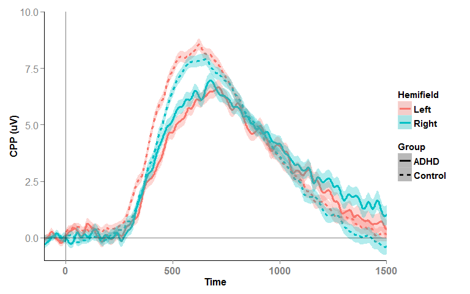
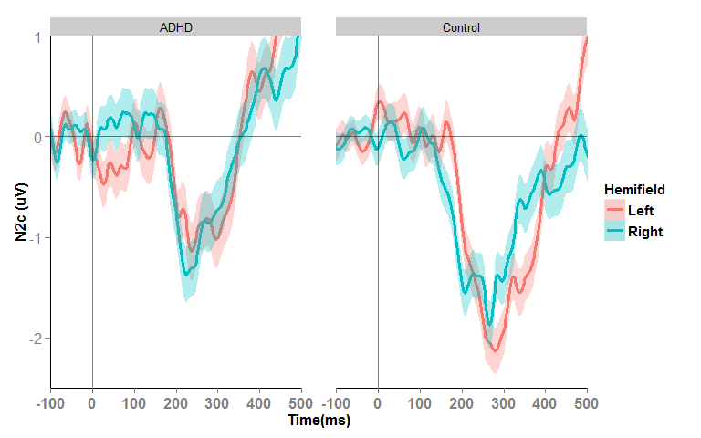
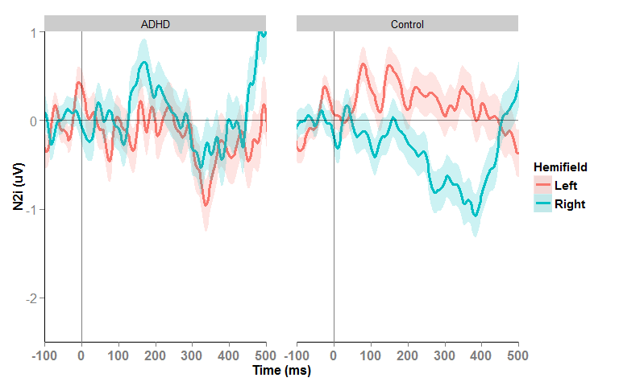
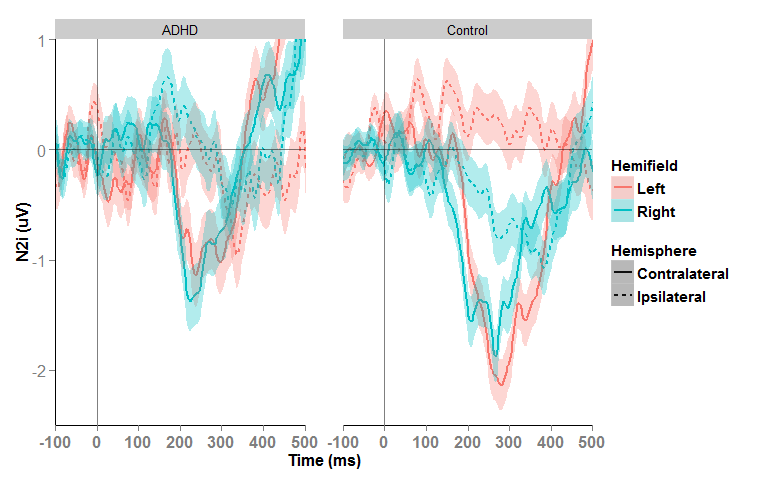
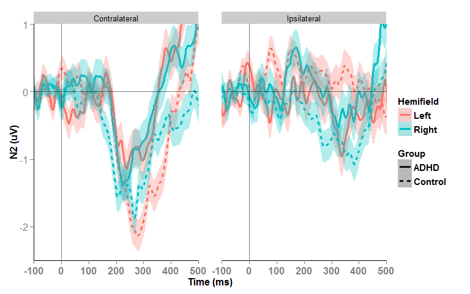

# ADHD_Control_Markdown_Stim_locked_ERP
Daniel Newman  
12 Dec 2015  


##Plot Stim-locked CPP:


```r
#CPP

data_Stim_locked_ERP2<-data_Stim_locked_ERP[!data_Stim_locked_ERP$Blinkneg100_100PR & !data_Stim_locked_ERP$LeftFixBreakneg100_100PR & !data_Stim_locked_ERP$RightFixBreakneg100_100PR & !data_Stim_locked_ERP$Art_neg100_100PR & !data_Stim_locked_ERP$BothFixBreakneg100_100PR, ]

data_Stim_locked_ERP2<-data_Stim_locked_ERP2[data_Stim_locked_ERP2$Accuracy=="Hit",]

source("summarySE.R") 
source("summarySEwithin.R") #function to calculate Std.Er of mean
source("normDataWithin.R")
plotdata_CPP <- summarySEwithin(data_Stim_locked_ERP2, measurevar="CPP", betweenvars=c("Group"), withinvars=c("Time", "Hemifield"), idvar="ID")
plotdata_CPP$Time<-as.numeric(as.character(plotdata_CPP$Time))
summary(plotdata_CPP$Time)
```

```
##    Min. 1st Qu.  Median    Mean 3rd Qu.    Max. 
##    -800    -130     540     540    1210    1880
```

```r
#CPP Group on same plot
ggplot(plotdata_CPP, aes(x=Time, y=CPP, color=Hemifield,fill=Hemifield, linetype=Group)) + 
    geom_line(size=1.4) + geom_ribbon(aes(ymin=CPP-se, ymax=CPP+se), alpha = 0.3, colour=NA) + #geom_errorbar(aes(ymin=CPP-se, ymax=CPP+se), alpha = 0.1) +  
        geom_hline(yintercept=0, alpha = 0.5) + geom_vline(xintercept=0, alpha = 0.5) +   
    coord_cartesian(ylim = c(-1, 10),  xlim = c(-100, 1500)) +
    xlab("Time") + ylab("CPP (uV)") +
    theme(axis.title.x = element_text(face="bold", size=12),
          axis.text.x  = element_text(face="bold", angle=0,  size=12)) +
    theme(axis.title.y = element_text(face="bold", size=12),
          axis.text.y  = element_text(angle=0, vjust=0.5, size=12)) +
    theme(legend.title = element_text(size=11, face="bold")) +
    theme(legend.text = element_text(size = 11, face = "bold")) +
    theme(panel.grid.major = element_blank(), panel.grid.minor = element_blank(), 
          panel.background = element_blank(), axis.line = element_line(colour = "black"))
```

 

##Plot Stim-locked N2 (contra and ipsi):


```r
#N2
data_Stim_locked_ERP2<-data_Stim_locked_ERP[!data_Stim_locked_ERP$Blinkneg100_400 & !data_Stim_locked_ERP$LeftFixBreakneg100_400 & !data_Stim_locked_ERP$RightFixBreakneg100_400 & !data_Stim_locked_ERP$Art_neg100_400 & !data_Stim_locked_ERP$BothFixBreakneg100_400, ]
data_Stim_locked_ERP2<-data_Stim_locked_ERP2[data_Stim_locked_ERP2$Accuracy=="Hit",]


#N2c  facet wrap by group
plotdata_N2c <- summarySEwithin(data_Stim_locked_ERP2, measurevar="N2c", betweenvars=c("Group"), withinvars=c("Time", "Hemifield"), idvar="ID")
plotdata_N2c$Time<-as.numeric(as.character(plotdata_N2c$Time))
summary(plotdata_N2c$Time)
```

```
##    Min. 1st Qu.  Median    Mean 3rd Qu.    Max. 
##    -800    -130     540     540    1210    1880
```

```r
ggplot(plotdata_N2c, aes(x=Time, y=N2c, color=Hemifield,fill=Hemifield)) + geom_line(size=1.4) + 
    geom_ribbon(aes(ymin=N2c-se, ymax=N2c+se), alpha = 0.3, colour=NA) +
    geom_hline(yintercept=0, alpha = 0.5) + geom_vline(xintercept=0, alpha = 0.5) +   
    coord_cartesian(ylim = c(-2.5, 1), xlim = c(-100, 500)) +
    xlab("Time(ms)") + ylab("N2c (uV)") +
    theme(axis.title.x = element_text(face="bold", size=12),
          axis.text.x  = element_text(face="bold", angle=0,  size=12)) +
    theme(axis.title.y = element_text(face="bold", size=12),
          axis.text.y  = element_text(angle=0, vjust=0.5, size=12)) +
    theme(legend.title = element_text(size=11, face="bold")) +
    theme(legend.text = element_text(size = 11, face = "bold")) +
    theme(panel.grid.major = element_blank(), panel.grid.minor = element_blank(), 
          panel.background = element_blank(), axis.line = element_line(colour = "black")) + facet_wrap(~ Group) +
    theme(panel.margin = unit(2, "lines"))
```

 

```r
#N2i 
plotdata_N2i <- summarySEwithin(data_Stim_locked_ERP2, measurevar="N2i", betweenvars=c("Group"), withinvars=c("Time", "Hemifield"), idvar="ID")
plotdata_N2i$Time<-as.numeric(as.character(plotdata_N2i$Time))
summary(plotdata_N2i$Time)
```

```
##    Min. 1st Qu.  Median    Mean 3rd Qu.    Max. 
##    -800    -130     540     540    1210    1880
```

```r
ggplot(plotdata_N2i, aes(x=Time, y=N2i, color=Hemifield,fill=Hemifield)) + geom_line(size=1.4) + 
    geom_ribbon(aes(ymin=N2i-se, ymax=N2i+se), alpha = 0.2, colour=NA) +
        geom_hline(yintercept=0, alpha = 0.5) + geom_vline(xintercept=0, alpha = 0.5) +   
    coord_cartesian(ylim = c(-2.5, 1), xlim = c(-100, 500)) +
    xlab("Time (ms)") + ylab("N2i (uV)") +
    theme(axis.title.x = element_text(face="bold", size=12),
          axis.text.x  = element_text(face="bold", angle=0,  size=12)) +
    theme(axis.title.y = element_text(face="bold", size=12),
          axis.text.y  = element_text(angle=0, vjust=0.5, size=12)) +
    theme(legend.title = element_text(size=11, face="bold")) +
    theme(legend.text = element_text(size = 11, face = "bold")) +
    theme(panel.grid.major = element_blank(), panel.grid.minor = element_blank(), 
          panel.background = element_blank(), axis.line = element_line(colour = "black")) + facet_wrap(~ Group) +
    theme(panel.margin = unit(2, "lines"))
```

 

```r
###################Plot N2c and N2i trace in the same plot #####################
plotdata_N2i$Hemisphere<-rep("Ipsilateral",length(plotdata_N2i[,1]))
names(plotdata_N2i)[names(plotdata_N2i)=="N2i"] <- "N2"
names(plotdata_N2i)[names(plotdata_N2i)=="N2i_norm"] <- "N2_norm"

plotdata_N2c$Hemisphere<-rep("Contralateral",length(plotdata_N2c[,1]))
names(plotdata_N2c)[names(plotdata_N2c)=="N2c"] <- "N2"
names(plotdata_N2c)[names(plotdata_N2c)=="N2c_norm"] <- "N2_norm"
plotdata_N2<-rbind(plotdata_N2i,plotdata_N2c)

#facet_wrap(~ Group)
ggplot(plotdata_N2, aes(x=Time, y=N2, color=Hemifield,fill=Hemifield, linetype=Hemisphere, size=Hemifield)) + 
    geom_line(size=1) + geom_ribbon(aes(ymin=N2-se, ymax=N2+se), alpha = 0.3, colour=NA) + 
        geom_hline(yintercept=0, alpha = 0.5) + geom_vline(xintercept=0, alpha = 0.5) +   
    coord_cartesian(ylim = c(-2.5, 1), xlim = c(-100, 500)) +
    xlab("Time (ms)") + ylab("N2i (uV)") +
    theme(axis.title.x = element_text(face="bold", size=12),
          axis.text.x  = element_text(face="bold", angle=0,  size=12)) +
    theme(axis.title.y = element_text(face="bold", size=12),
          axis.text.y  = element_text(angle=0, vjust=0.5, size=12)) +
    theme(legend.title = element_text(size=11, face="bold")) +
    theme(legend.text = element_text(size = 11, face = "bold")) +
    theme(panel.grid.major = element_blank(), panel.grid.minor = element_blank(), 
          panel.background = element_blank(), axis.line = element_line(colour = "black")) + facet_wrap(~ Group) +
    theme(panel.margin = unit(2, "lines"))
```

 

```r
#  facet_wrap(~ Hemisphere)
ggplot(plotdata_N2, aes(x=Time, y=N2, color=Hemifield,fill=Hemifield, linetype=Group)) + 
    geom_line(size=1.4) + geom_ribbon(aes(ymin=N2-se, ymax=N2+se), alpha = 0.3, colour=NA) + 
        geom_hline(yintercept=0, alpha = 0.5) + geom_vline(xintercept=0, alpha = 0.5) +   
    coord_cartesian(ylim = c(-2.5, 1), xlim = c(-100, 500)) +
    xlab("Time (ms)") + ylab("N2 (uV)") +
    theme(axis.title.x = element_text(face="bold", size=12),
          axis.text.x  = element_text(face="bold", angle=0,  size=12)) +
    theme(axis.title.y = element_text(face="bold", size=12),
          axis.text.y  = element_text(angle=0, vjust=0.5, size=12)) +
    theme(legend.title = element_text(size=11, face="bold")) +
    theme(legend.text = element_text(size = 11, face = "bold")) +
    theme(panel.grid.major = element_blank(), panel.grid.minor = element_blank(), 
          panel.background = element_blank(), axis.line = element_line(colour = "black")) + facet_wrap(~ Hemisphere) +
    theme(panel.margin = unit(2, "lines"))
```

 


